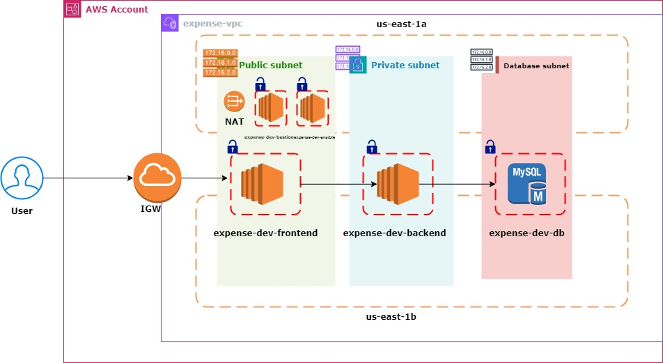

## expenses project using terraform

In every project provisioning the infrastructure is the first step we do.In this project we are  deploying 3-tier architecture in AWS using terraform and ansible.For high availability, we are provisioning the infrastructure in multiple availability zones. By using terraform provisioning the infrastructure and by using ansible configuring the servers. To provision the infrastructure,we are using our own modules and opensource modules as well. To provision vpc,we are using our own VPC module. To provision security groups, we are using our own SG module. To provision frontend and backend server, we are using open source module. To provision db server, we are using Amazon RDS service in aws. To configure frontend and backend servers we are integrating terraform with ansible. To configure Db server, we are using opensource RDS module.

# VPC - virtual private cloud

By using vpc module we are creating below resources in aws

* VPC in us-east region
* IGW to give public access to our vpc
* IGW attachment to VPC
* 2 public subnets in two azs for HA 
* 2 private subnets in two azs for HA 
* 2 database subnets in two azs for HA 
* Database subnet group for all the DB subnets created
* Elastic ip address to provide static IP for NAT gateway
* NAT gateway to give access to the instances running in private and db subnets
* public route table for 2 public subnets 
* private route table for 2 private subnets
* database route table for 2 db subnets
* adding routes to all the route tables in vpc
* public route table and public subnets associations
* private route table and private subnets associations
* database route table and db subnets associations
* peering if required
* adding routes in route tables of all the subnets in vpc for peering connection between requestor and acceptor vpc

# Security Groups

By using SG module we are creating SG for each instance. In our project we have a requirement to create SG for each instance that gets created

* SG for db instance that gets launched in DB subnet
* SG for backend instance that gets launched in private subnet
* SG for frontend instance that gets launched in public subnet
* SG for bastion host that gets launched in public subnet
* SG for ansible that gets launched in public subnet
* SG inbound rules for db security group
    * inbound rules for db accepting connections from backend
    * inbound rules for db accepting connections from bastion
* SG inbound rules for backend security group
    * inbound rules for backend accepting connections from frontend
    * inbound rules for backend accepting connections from ansible
    * inbound rules for backend accepting connections from bastion host
* SG inbound rules for frontend security group
    * inbound rules for frontend accepting connections from public
    * inbound rules for frontend accepting connections from ansible
    * inbound rules for frontend accepting connections from bastion
* SG inbound rules for ansible security group
    * inbound rules for ansible accepting connections from public
* SG inbound rules for bastion security group
    * inbound rules for bastion accepting connections from public

# Instances

By using open source module we create 
- bastion host
- Ansible server
- frontend server
- backend server

By using Amazon RDS we create
- db server

bastion host is launched in public subnet so that backend,db running in private subets can be accessed to troubleshoot,to check connection etc
ansible server is launched in public subnet to configure frontend and backend servers
db server is configured by Amazon RDS automatically

# route53 records

After launching and configuring the servers we create route 53 records using open source module
- route53 record for db server using its endpoint created by RDS
- route53 record for backend using its private IP
- rouete53 record for frontend using its public IP
